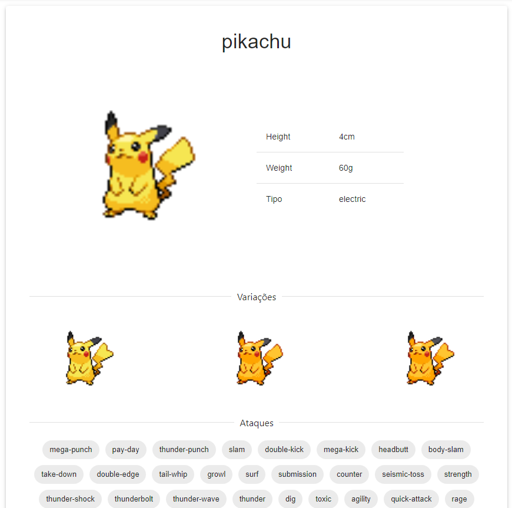

# Pok-Dex
  
Trabalho de Desenvolvimento Web III  
Link do site: https://pok-dex-api.vercel.app/

# Descrição
"Pok-Dex" é um projeto desenvolvido como parte de um trabalho da aula de desenvolvimento web 3. Ele utiliza a API de Pokémon para fornecer informações detalhadas sobre os Pokémons disponíveis. O site foi implementado para pesquisar e descobrir informações de um pokemon como sua altura, peso, tipo, variações do mesmo e os ataques que ele pode aprender que estão listados na pokedex. No momento esta limitado a só os primeiros 200 pokemons.

# Layout 
## Home

## Botão para o inicio

## Pesquisa funcional

## Card com informações

# Tecnologias utilizadas
## Front end
-React.js
-Material-UI
-React Router
-Axios
-Hooks

## Back end
-API: PokéAPI

## Hospedagem
-Vercel

# Como executar o projeto
Pré-requisitos: ter instalado npm ou yarn, axios e o mui
- Clonar repositório
git clone https://github.com/Metronox/Pok-Dex-Api

- Executar
npm start

# Autor
Samuel Santos Souza
